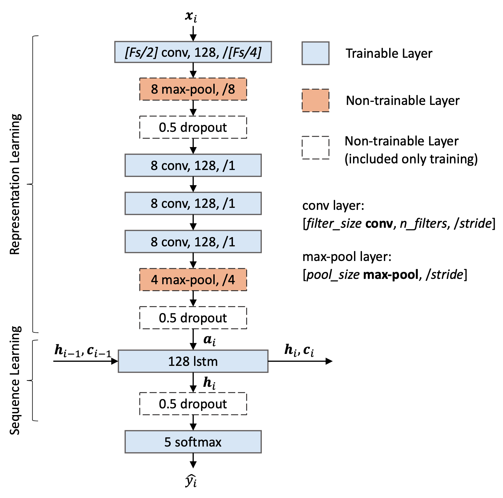

## Model Architecture

Note: Fs is the sampling rate of the input EEG signals

<!-- ## Performance Comparison

Note: ACC = accuracy, MF1 = Macro F1-Score -->

## Environment

* CUDA 10.0
* cuDNN 7
* Tensorflow 1.13.1

## Create a virtual environment with conda

```bash
conda create -n tinysleepnet python=3.6
conda activate tinysleepnet
pip install -r requirements.txt
```

## How to run

1. `python download_sleepedf.py`
1. `python prepare_sleepedf.py`
1. `python trainer.py --db sleepedf --gpu 0 --from_fold 0 --to_fold 19`
1. `python predict.py --config_file config/sleepedf.py --model_dir out_sleepedf/train --output_dir out_sleepedf/predict --log_file out_sleepedf/predict.log --use-best`

## Licence
- For academic and non-commercial use only
- Apache License 2.0
